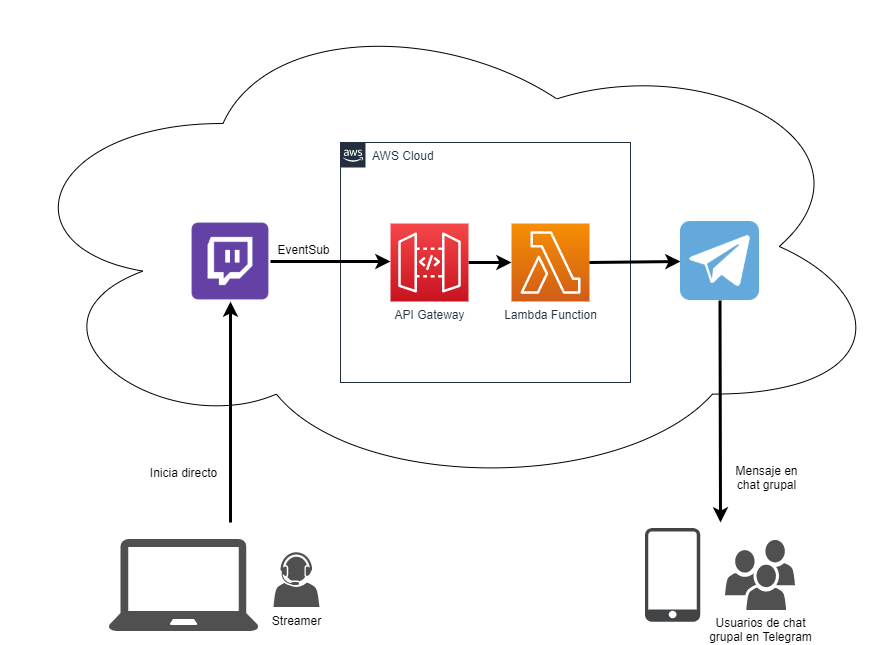

# twitch-telegram-bot

Bot de Telegram que avisa cuando el streamer comienza directo en Twitch.

Este código puedes utilizarlo por ejemplo en una función AWS Lambda. En el momento de escribir esto, AWS ofrece 1 millón de ejecuciones gratuitas al mes para funciones AWS Lambda. La función AWS Lambda puedes invocarla a través de una URL usando Amazon API Gateway (también tiene free tier). Se recomienda usar un access token en dicha URL, como en el código de este repo.

## Cómo funciona

1. Twitch invoca a nuestra URL cada vez que sucede el evento al que nos suscribimos, en este caso el evento "streamer 'X' está online". 

Para suscribirnos a estos eventos en Twitch, usamos EventSub: <https://dev.twitch.tv/docs/eventsub>

2. Para crear el bot de telegram, utilizamos los mismos pasos explicados aquí:
<https://javiercampos.es/blog/2020/12/13/como-recibir-avisos-automaticos-por-telegram-email-slack-etc-si-tu-skill-alexa-esta-fallando/>

Usado en el canal Telegram de Patreon de DotCSV <https://www.twitch.tv/dotcsv>.